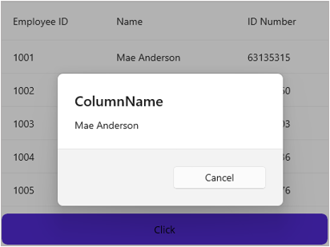

# How to get the cell value of specific row and column in .NET MAUI DataGrid SfDataGrid
You can get the cell value of specific row and column in [SfDataGrid](https://www.syncfusion.com/maui-controls/maui-datagrid) by using the **SfDataGrid.GetCellValue** method. You need to pass the underlying data object and the mapping name of the column to find the cell value.

 
 ```XML
 <StackLayout>
    <syncfusion:SfDataGrid  ItemsSource="{Binding Employees}"
                            AutoGenerateColumnsMode="None"
                            ColumnWidthMode="Auto"
                            DefaultColumnWidth="155">

        <syncfusion:SfDataGrid.Columns>
            <syncfusion:DataGridTextColumn MappingName="EmployeeID"
                                           HeaderText="Employee ID" />
            <syncfusion:DataGridTextColumn MappingName="Name"
                                           HeaderText="Name" />
            <syncfusion:DataGridTextColumn MappingName="IDNumber"
                                           HeaderText="ID Number" />
        </syncfusion:SfDataGrid.Columns>
        
    </syncfusion:SfDataGrid>

    <Button Text="Click"
            HorizontalOptions="StartAndExpand"
            WidthRequest="460"
            TextColor="Black">
        <Button.Behaviors>
            <behaviors:ButtonBehavior />
        </Button.Behaviors>
    </Button>
</StackLayout>
 ```
 
The below code illustrates how to get the cell value of the specific row and column in a button click.
 
 ```XML
 public class ButtonBehavior : Behavior<Button>
{
    protected override void OnAttachedTo(Button button)
    {
        base.OnAttachedTo(button);
        button.Clicked += OnButtonClicked!;
    }

    protected override void OnDetachingFrom(Button button)
    {
        base.OnDetachingFrom(button);
        button.Clicked -= OnButtonClicked!;
    }

    string? cellValue;
    private void OnButtonClicked(object sender, EventArgs e)
    {
        var button = sender as Button;
        var stackLayout = button!.Parent as StackLayout;
        var dataGrid = stackLayout!.Children[0] as SfDataGrid;
        foreach (var column in dataGrid!.Columns)
        {
            if (column.MappingName == "Name")
            {
                var rowData = dataGrid.GetRecordAtRowIndex(1);
                cellValue = dataGrid.GetCellValue(rowData, column.MappingName) as String;
                break;
            }
        }
        Application.Current!.MainPage!.DisplayAlert("ColumnName", cellValue, "Cancel");
    }
}
 ```
 
 
 

[View sample in GitHub](https://github.com/SyncfusionExamples/How-to-get-the-cell-value-of-specific-row-and-column-in-.NET-MAUI-DataGrid-SfDataGrid)
 
Take a moment to explore this [documentation](https://help.syncfusion.com/maui/datagrid/overview), where you can find more information about Syncfusion .NET MAUI DataGrid (SfDataGrid) with code examples. Please refer to this [link](https://www.syncfusion.com/maui-controls/maui-datagrid) to learn about the essential features of Syncfusion .NET MAUI DataGrid (SfDataGrid).
 
##### Conclusion
 
I hope you enjoyed learning about how to get the cell value of specific row and column in .NET MAUI DataGrid (SfDataGrid).
 
You can refer to our [.NET MAUI DataGrid’s feature tour](https://www.syncfusion.com/maui-controls/maui-datagrid) page to learn about its other groundbreaking feature representations. You can also explore our [.NET MAUI DataGrid Documentation](https://help.syncfusion.com/maui/datagrid/getting-started) to understand how to present and manipulate data. 
For current customers, you can check out our .NET MAUI components on the [License and Downloads](https://www.syncfusion.com/sales/teamlicense) page. If you are new to Syncfusion, you can try our 30-day [free trial](https://www.syncfusion.com/downloads/maui) to explore our .NET MAUI DataGrid and other .NET MAUI components.
 
If you have any queries or require clarifications, please let us know in the comments below. You can also contact us through our [support forums](https://www.syncfusion.com/forums), [Direct-Trac](https://support.syncfusion.com/create) or [feedback portal](https://www.syncfusion.com/feedback/maui?control=sfdatagrid), or the feedback portal. We are always happy to assist you!
